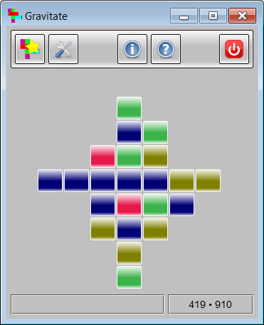

# Gravitate

A SameGame/TileFall-like game written in Rust/FLTK.

Tested on Linux and Windows.

`gravitate.exe` *is a precompiled Windows binary that should run on any
64-bit version of Windows* (1.6MB; MD5 8bb3d075ea27c03533134eaad79e459c)

## Dependencies

Rust; see Cargo.toml for third-party crates.

## License

GPL-3.0.

## Other Versions

For versions in Tcl/Tk, C++/wxWidgets, D/GtkD, Nim/NiGui, Java/AWT/Swing,
Python/Tkinter, Python/wxPython, and JavaScript see
[www.qtrac.eu/gravitate.html](http://www.qtrac.eu/gravitate.html).
